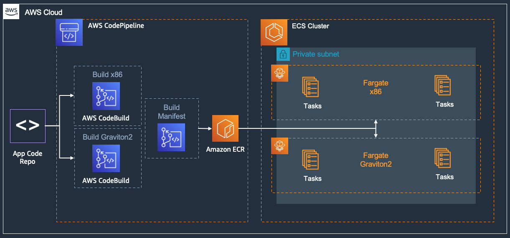
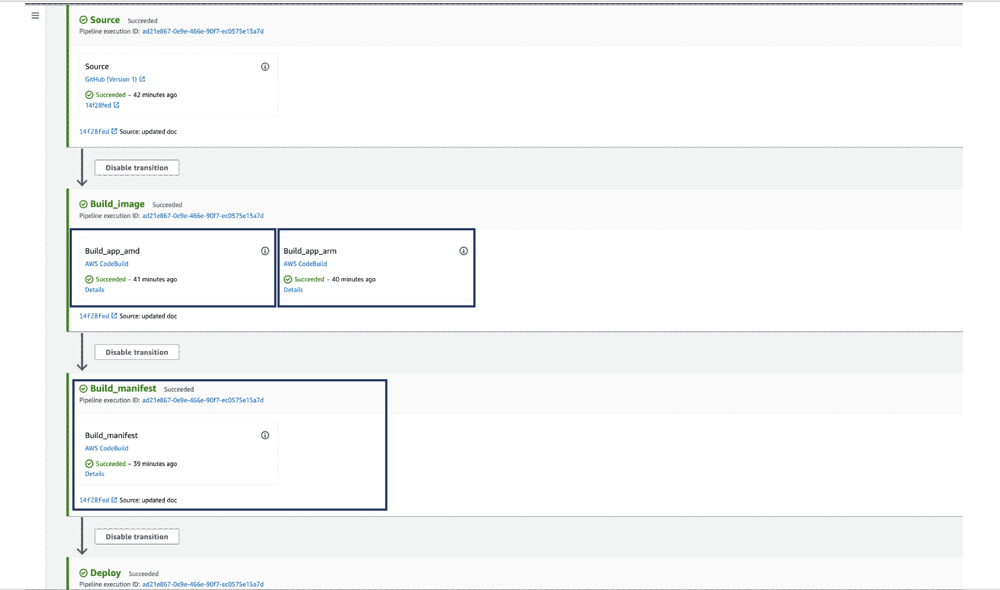
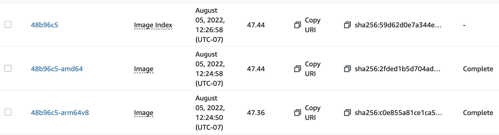

# Graviton and Multi-Architecture Container Images

AWS Graviton processors are custom built by Amazon Web Services using 64-bit Arm Neoverse cores to deliver the best price performance for your cloud workloads. AWS Fargate supports Gravtion enabling containerized workloads to benefit from Graviton lower price with better performance.

This solution blueprint focuses on how to build multi-architecture images, store them in ECR, and most importantly launch tasks on both Fargate x86 and ARM without juggling architecture specific container images.

## Deploy the Core Infrastructure

> [!IMPORTANT]
> If you have already deployed the infra then you can skip this step.

Deploy the [core-infrastructure](../core-infra/index.md).

## Deploy the Blueprint

- Create a [Github token](https://docs.github.com/en/authentication/keeping-your-account-and-data-secure/creating-a-personal-access-token) to access the forked repository.

- Store the secret in AWS Secrets Manager in the region where you want to deploy the blueprints.

```shell
aws secretsmanager create-secret --name ecs-github-token --secret-string <your-github-access-token>
```

- Verify the service-linked role exists:

Codestar notification rules require a **one-time** creation of a service-linked role. Please verify one exists or create the codestar-notification service-linked role.

```shell
 aws iam get-role --role-name AWSServiceRoleForCodeStarNotifications
```

If you receive the following error:
```shell
An error occurred (NoSuchEntity) when calling the GetRole operation: The role with name > AWSServiceRoleForCodeStarNotifications cannot be found.
```

... then you need to create the service-linked role with the `aws cli` as show here:

```shell
aws iam create-service-linked-role --aws-service-name codestar-notifications.amazonaws.com
```

Once this is created, you will not have to complete these steps for the other examples.

- Navigate to the blueprint folder:

```shell
cd ecs-blueprints/terraform/fargate-examples/graviton/
```

- Run the following:

```shell
terraform init
terraform plan
terraform apply
```

## Solution Architecture



## Solution Details

The solution has following key components:

- AWS CodePipeline: The CodePipeline for building and storing the multi-architecture images has 2 AWS CodeBuild build projects (as shown in picture below):
    - Build_image : This has two actions, one to build amd64(x86) image and the other for arm64 image. Those images have a suffix `amd64` and `arm64v8` respectively. Both the build image actions use the same [buildspec.yml](../../../application-code/nodejs-demoapp/templates/buildspec.yml)
    - Build_manifest : This is to create a manifest file. From [docker manifest](https://docs.docker.com/engine/reference/commandline/manifest/) - A single manifest is information about an image, such as layers, size, and digest. The docker manifest command also gives users additional information such as the os and architecture an image was built for. The [build_manifest.yml](../../../application-code/nodejs-demoapp/templates/buildspec_manifest.yml) creates and pushed the manifest file. This file also copys the image url, without any architecture suffix, to update the task definition and deploy tasks for service.



* The ECR repository looks like below with the manifest along with the image tag, and the two actual images with respective architecture tags.



* Two ECS services are created one with x86 Fargate tasks (nodejs-multi-arch) and the other with arm64 Fargate tasks (nodejs-multi-arch-arm). You can check the task definition that each of them have the same image `"image": "xxx.dkr.ecr.us-west-2.amazonaws.com/nodejs-multi-arch:14f28fe"` **without the architecture suffix**. The ECS agent running in Fargate task will leverage the manifest to fetch the right image!

> [!NOTE]
> The CodeBuild and CodePipeline services are provisioned and configured here. However, they primarily interact with the [application-code/nodejs-demoapp/](../../../application-code/nodejs-demoapp/) repository. CodePipeline is listening for changes and checkins to that repository. And CodeBuild is using the *Dockerfile* and *templates/* files from that application folder.
